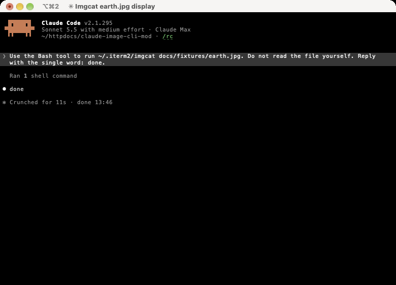
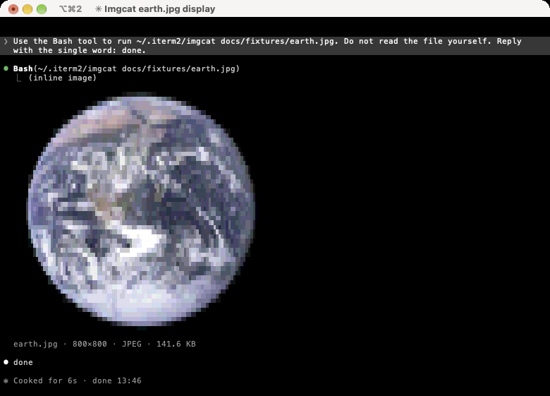
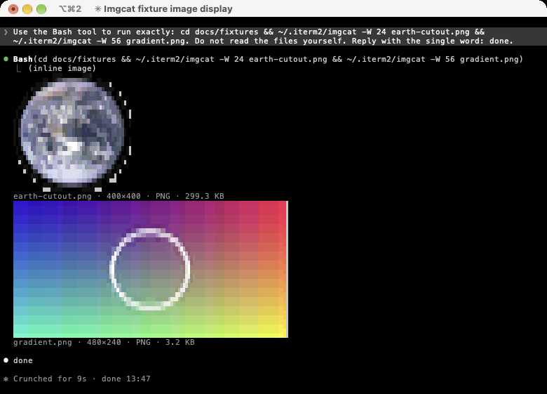
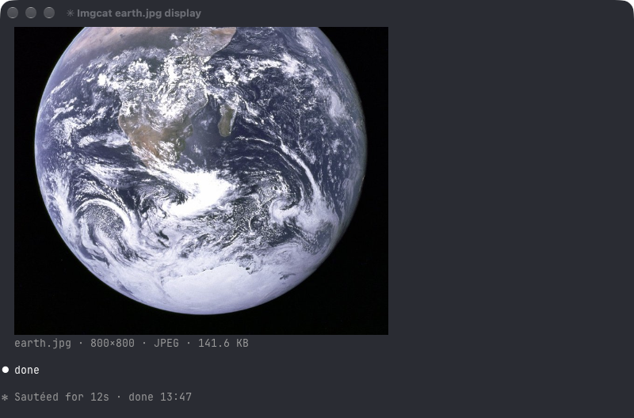

# inline-images

inline-images is a Claude Code mod. It shows the images that a command prints with the [iTerm2 inline images protocol](https://iterm2.com/documentation-images.html).

Tools such as `imgcat`, `it2cat`, `chafa -f iterm`, `timg -piterm` and `wezterm imgcat` print an image as an escape sequence. Claude Code does not draw it. Without this mod, you see "Ran 1 shell command" and the model reads a wall of base64.

| Without the mod | With the mod |
|---|---|
|  |  |

The picture above is a NASA photo of the Earth, in iTerm2. The mod draws it with coloured block characters, so it works in every terminal.

## What it does

- It draws each image under the tool call that printed it.
- It opens the "Ran 1 shell command" group when the group holds an image.
- It removes the base64 from what the model reads. A 1 MB image is about 1.3 million characters.
- It reads output that Claude Code cut at 30,000 characters, so large images work.
- It keeps the shape of the picture. It measures your terminal cell and fits the picture to it.
- It supports transparency, several images in one command, and the `width`, `height` and `preserveAspectRatio` arguments.



The first image above is a PNG with a transparent background. Its `-W 24` argument sets the width. The second image has `-W 56`.

## Install

Type this in a Claude Code session:

```
/plugin install inline-images --marketplace chrisns/claude-image-cli-mod
```

Answer `y` to add the marketplace. Then choose a scope.

To try it from a clone of this repository:

```
claude --plugin-dir ./mod
```

### Requirements

- macOS or Linux.
- Python 3.
- [Pillow](https://pypi.org/project/pillow/). Run `python3 -m pip install Pillow`.

ImageMagick (`magick`) works in place of Pillow. It also reads formats that Pillow cannot, for example HEIC when ImageMagick has the delegate.

## Renderers

The `renderer` option chooses how a picture is drawn.

| Value | What it does |
|---|---|
| `auto` | Use `image` in kitty and Ghostty. Use `cells` everywhere else. This is the default. |
| `cells` | Draw coloured block characters. Each cell holds 2 by 2 pixels. This works in every terminal. |
| `image` | Draw real pixels with the kitty graphics protocol. Only kitty and Ghostty support it. |

This is the same photo in Ghostty with `image`:



iTerm2 does not draw the kitty graphics protocol. The mod cannot write the iTerm2 protocol back to the terminal, because Claude Code owns the screen. So iTerm2 uses `cells`.

## Options

Change them in the config menu of Claude Code, or under `pluginConfigs` in your settings.

| Option | Default | What it does |
|---|---|---|
| `renderer` | `auto` | `auto`, `cells` or `image`. |
| `max_columns` | `100` | The widest a preview can be. |
| `max_rows` | `28` | The tallest a preview can be. |
| `palette` | `0` | Reduce a `cells` preview to this many colours. `0` keeps all colours. Claude Code paints about 1024 different colour pairs at once. A value near `32` can look cleaner on a busy picture. |
| `hide_from_model` | `true` | Replace the image data in the tool result with a one-line note. |
| `python` | `python3` | The Python 3 command that runs `mod/bin/render.py`. |

## How it works

1. A `ui.render` hook for `ToolResult`, `ToolUse` and `ToolGroup` finds `ESC ] 1337 ;` in the output of a tool.
2. `mod/hooks/osc1337.ts` reads the sequences: `File=`, the chunked `MultipartFile`, `FilePart` and `FileEnd` that `imgcat` 3 uses, both terminators (`BEL` and `ESC \`), and the tmux passthrough wrapper.
3. If Claude Code saved a large output to a file, `mod/bin/render.py scan` reads the file. The sandbox of a mod can read at most 4 MiB.
4. `mod/bin/render.py` decodes the image, scales it to the box and builds the cells. It picks the best of 8 quadrant glyphs for each cell. It finds the real cell size with `TIOCGWINSZ` on the terminal of the parent process.
5. A `session.append` hook removes the data from the tool result that the model reads. The transcript keeps the whole output, so the preview comes back after a resume.

Decoded images are cached in a private folder under your temp directory. The mod removes files after 24 hours.

## Limits

- A GIF shows its first frame.
- The preview is a still picture. It does not move.
- A cell preview has about 4 by 8 pixels in each cell. It is a preview, not a viewer.
- The model cannot see the image. It reads a note such as `[inline image: earth.jpg, 141.6 KB]`. To let the model look at a picture, ask it to read the file.
- `image` shows a blank box when the terminal is on another machine, for example over ssh. The terminal must be able to read the file.

## Develop

```
claude plugin validate .
claude plugin test mod
python3 -m unittest discover -s mod/tests -p 'test_*.py'
```

To type-check, start a session with the mod once so that Claude Code writes the types. Then run `npx -p typescript tsc -p mod`.

### Make the screenshots again

The scripts in `scripts/` drive iTerm2 and Ghostty on macOS. They start a session with Haiku, send a prompt and save the window. The screenshot needs the Screen Recording permission.

```
scripts/screenshot.sh docs/screenshots/raw-with.png with 'Use the Bash tool to run ~/.iterm2/imgcat docs/fixtures/earth.jpg. Do not read the file yourself. Reply with the single word: done.'
python3 scripts/crop-screenshot.py docs/screenshots/raw-with.png docs/screenshots/with-mod.png
```

`crop-screenshot.py` removes the input box and the status lines.

## Credits

The Earth photo in `docs/fixtures/earth.jpg` is [The Earth seen from Apollo 17](https://commons.wikimedia.org/wiki/File:The_Earth_seen_from_Apollo_17.jpg). NASA made it. It is in the public domain.

## Licence

MIT. See [LICENSE](LICENSE).
